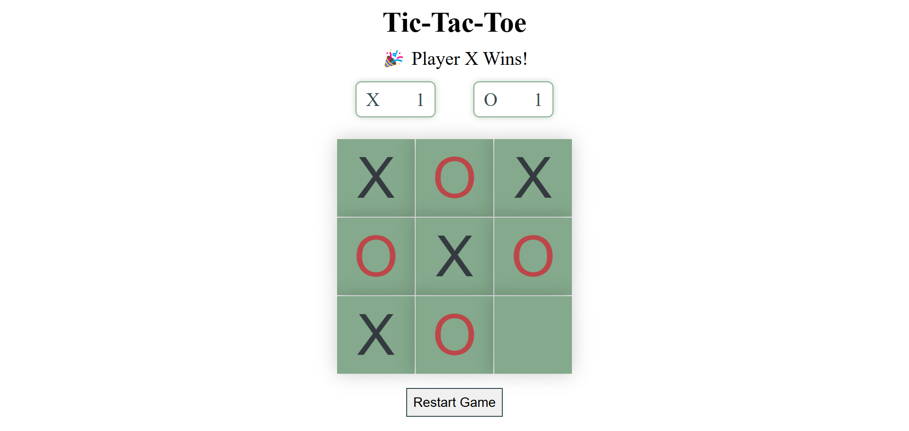

# 🎮 Tic-Tac-Toe Game

A fun, interactive, and responsive Tic-Tac-Toe web game built using HTML, CSS, and JavaScript.
The project demonstrates clean logic, intuitive design, and asynchronous gameplay control using async/await for smooth performance.

This version also includes two special features — a Score Tracker that maintains wins for both players until refresh, and a Restart Button for quick replays.

## 🧩 Description

The **Tic-Tac-Toe Game** allows two players (“X” and “O”) to compete in a classic 3×3 grid.
After each move, the game automatically checks for a winner or a draw, updates scores dynamically,
and resets the board when needed — all without reloading the page.

This project demonstrates clean **JavaScript event handling**, **dynamic DOM updates**,
and modern **async/await** logic for a smooth gaming experience.


## 🚀 Features

🎯 **Two-Player Gameplay** – Play alternately as “X” and “O”<br>
💥 **Instant Win Detection** – Auto-checks all 8 winning combinations<br>
⚖️ **Draw Detection** – Declares a tie when the board is full<br>
📊 **Score Tracker** – Tracks wins of “X” and “O” until page refresh<br>
🔁 **Restart Button** – Resets only the board without losing scores<br>
⚡ **Asynchronous Flow** – Uses `async/await` for non-blocking game logic<br>
🎨 **Responsive UI** – Scales seamlessly on desktop and mobile<br>
💬 **Clean Design** – Simple, minimalistic layout with smooth transitions<br>


## ⚙️ Tech Stack

**Frontend:** HTML5, CSS3, JavaScript (ES6)<br>
**Logic Handling:** Async/Await for sequential function execution<br>
**Version Control:** Git & GitHub<br>


## 🖼️ Tic Tac Toe Game Screenshot



## 🌟 Future Enhancements

✨ **AI Opponent** – Implement a single-player mode using the Minimax algorithm<br>
🎵 **Sound Effects** – Add sound feedback for moves and wins<br>
💾 **Local Storage** – Save scores even after page refresh<br>
🌈 **Theme Toggle** – Add dark/light mode for better user experience<br>


## 💡 How to Run Locally

```bash
git clone https://github.com/Navyasri-18/Tic-Tac-Toe-Game.git
cd Tic-Tac-Toe-Game
start index.html
```

Then simply open the game in your browser and start playing! 🎮

